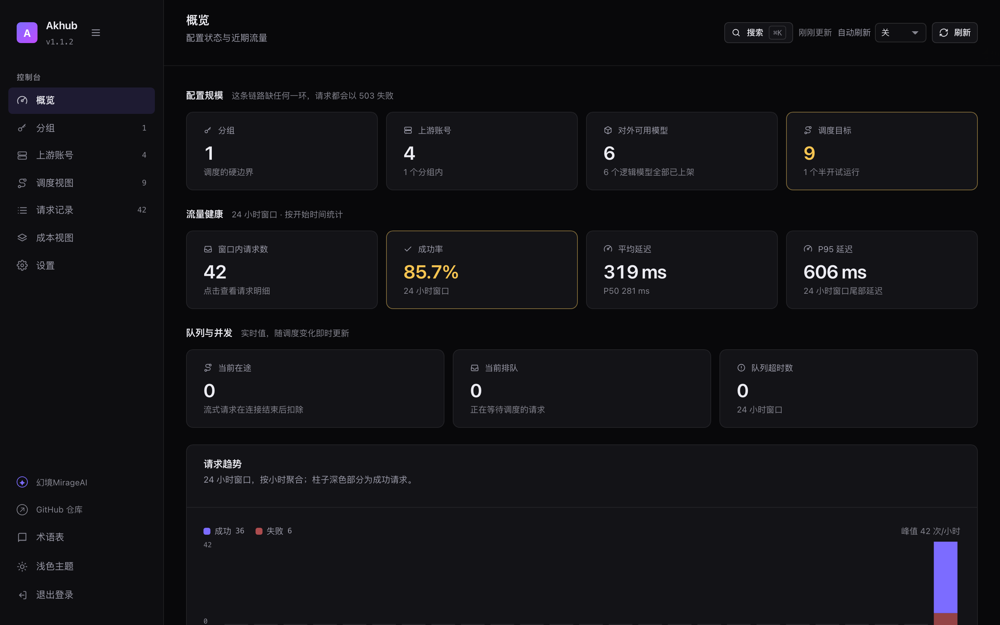
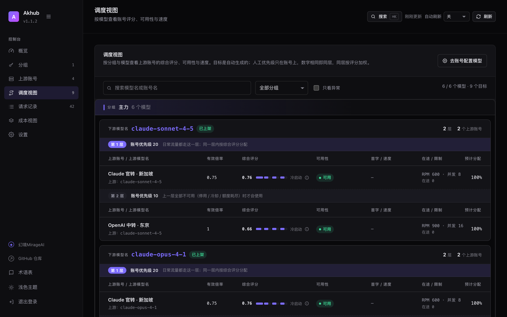
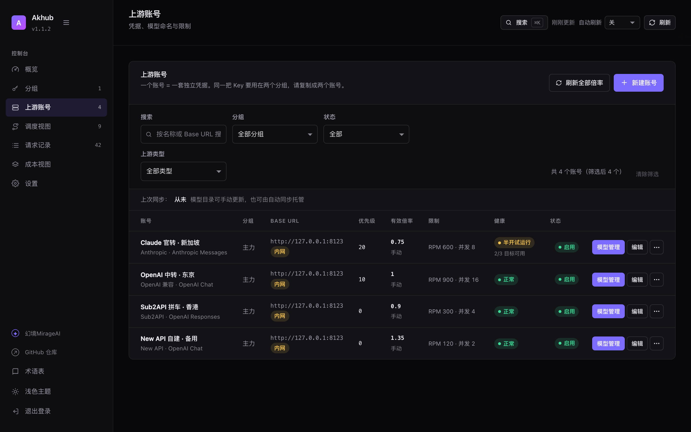
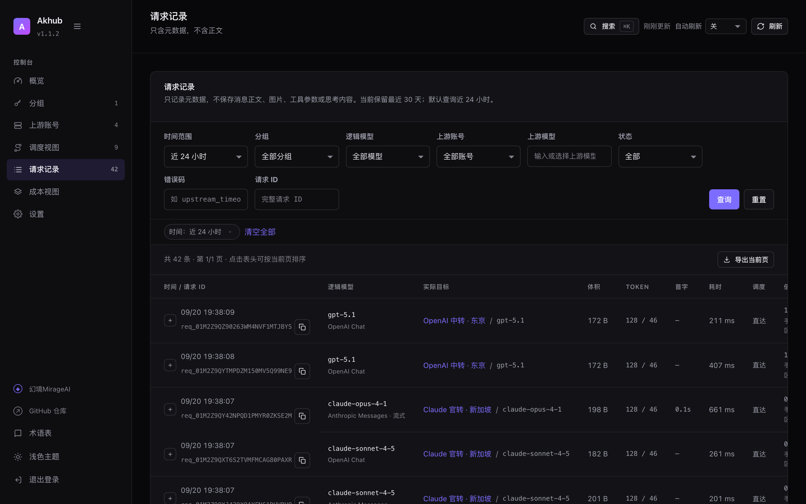
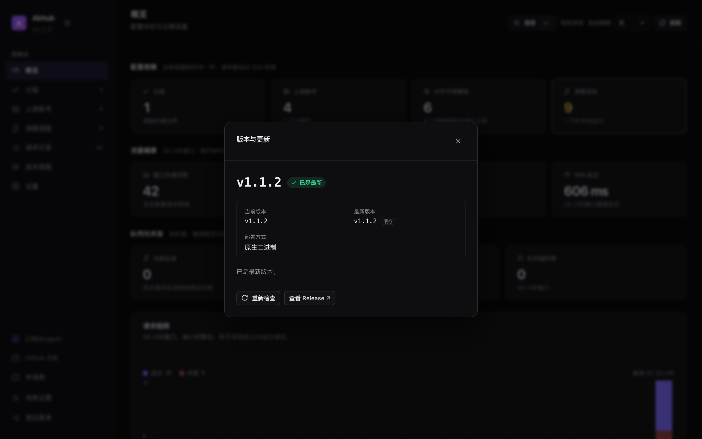

# Akhub

**一个简单、可靠、高性能的 AI 协议网关与组内负载均衡工具。**

[](https://github.com/HsMirage/Akhub/releases)
[](https://github.com/HsMirage/Akhub/actions/workflows/ci.yml)
[](#许可与来源)

把 Claude Code、Codex CLI 和任意 OpenAI 客户端接到 Akhub 上，由它统一分发到多个
上游账号：**同协议原样透传，跨协议自动互转，组内按严格优先级与实时评分分流，
失败时在不重复浪费的前提下换一个账号**。

- 单文件二进制或一个容器就能跑，不需要额外的数据库、队列或 Redis。
- 管理后台内嵌在二进制里，打开 `/admin` 设置管理员密码即可开始用。
- 上游凭据加密落库、日志脱敏、请求正文不落盘，默认拒绝访问内网与云元数据地址。



---

## 目录

- [核心能力](#核心能力)
- [快速开始](#快速开始)
- [客户端接入](#客户端接入)
- [支持的接口](#支持的接口)
- [版本检查与升级](#版本检查与升级)
- [环境变量](#环境变量)
- [必须知道的行为](#必须知道的行为)
- [开发](#开发)
- [部署](#部署)
- [许可与来源](#许可与来源)

---

## 核心能力

### 三个协议入口，同协议零改动透传

`POST /v1/chat/completions`、`POST /v1/messages` 与 `POST /v1/responses`
各走各的原生通路：请求体、SSE 事件、错误对象都按上游原本的形状收发，不解析、
不重排、不补齐，因此不会因为"网关多懂了一点"而丢字段。

### 跨协议六方向互转

一个分组里只有 Messages 端点、而客户端说的是 Chat Completions 时，请求照样送得到：
请求先解析成统一的中间格式再发往目标协议，工具调用、思考块、图像输入、结构化输出
与 usage（含缓存读写）在三个协议之间往返。入口与端点协议相同时仍然直通，不付转换代价。

**能力降级是白名单制**：工具、结构化输出、图像/文件、角色语义在目标端点无法表达时
明确返回 400，绝不静默丢弃；只有思考与协议特有的采样参数（`top_k` 等）允许丢，
且仅发生在故障切换里——同一层内先试无损候选，全部失败才轮到降级候选。发生降级的请求
带 `X-Akhub-Degraded` 响应头，记录里也会标出来。

### 严格优先级阶梯 + 层内四维评分

优先级数字相同的目标构成一层：**高层只要还有合格目标就优先使用，层内全忙时在本层排队，
不降层**。"忙"不等于"坏"——想让两个账号自动分担流量，把它们设成同一个优先级。

层内按四个维度打分后加权随机分配：倍率、可靠性、首字延迟、输出速度。倍率用比值归一化，
性能用 EWMA 统计（样本不足时取中性分），分组级权重可调。

抽签权重是 `分数^8 + 探索口粮`。加性底权保证**最差的合格目标也拿得到约 3% 的流量**——
冷目标拿不到样本就永远是中性分、永远排在热目标之后，等于再也回不到评分里。
参照系同时要求**至少两个热目标**才成立，否则刚跑过几次的账号会把自己算成"全组最快"
而自动满分。分数仍是主导项，主力照常拿到绝大多数流量。



### 会话粘性

Responses 状态链 → 显式会话头 → `prompt_cache_key` → 稳定前缀哈希（system prompt +
工具定义，不含用户消息，`/compact` 不断链）。等待预算按请求体体积与缓存新鲜度计算，
带 `Retry-After` 的 429 会在预算内原地等待，而不是立刻换账号丢掉缓存。

**前三级与第四级的强度不同。** 前三级是**强身份**：客户端明确说了"这是同一件事的
延续"，换账号会真的打断它，因此钉死绑定。第四级稳定前缀是**弱身份**——被同一套
system prompt 与工具定义命中的所有会话都落在一个键上，它只代表"同一个项目"。
把这种键钉死就等于"一个项目 = 一个上游账号"，某个账号变慢之后评分再低也换不掉流量。
所以弱身份只做**软亲和**：绑定目标在层内抽签里权重放大 4 倍（前缀缓存的价值基本保住），
但每次请求都重新抽一次签；同时真正保住缓存的那把 **Key** 仍优先复用。

### 熔断、限流与故障切换边界

- 60 秒窗口内连续或高比例故障进入指数冷却，冷却后只放行一个半开试运行请求。
- 401/403 停整个账号；429 只停"账号 + 模型"；RPM / TPM / 最大并发按账号默认、目标可覆盖。
- 廉价失败（连接失败、明确的 4xx）不计入任何次数上限；流式响应在第一个有语义的事件
  之前仍可切换，之后**禁止拼接第二个上游**；慢请求与总超时不重放。

### 模型发现、别名与自动倍率

账号模型页可以拉取上游模型列表、手动补充、逐行启用停用、把不同上游的同一个模型归并成
一个对外名，也可以交给自动同步全量托管。倍率支持手动填写，或由 Sub2API / New API 探针
周期刷新（带抖动、退避与风险余量宽限期；探针失败不会立刻停用账号）。

### 内嵌管理后台

React + TypeScript 写的单页后台在编译期嵌进二进制，不需要单独部署前端：
概览指标与请求趋势、分组与下游 Key、上游账号与模型目录、只读调度视图、请求记录
（只存元数据，可按状态/错误码/模型/账号筛选）、成本视图、系统设置与配置备份。





---

## 快速开始

### Docker（推荐）

```bash
docker compose up -d
# 打开 http://127.0.0.1:8080/admin 设置管理员密码
```

### 一键脚本（Linux / macOS）

```bash
curl -fsSL https://raw.githubusercontent.com/HsMirage/Akhub/master/install.sh | sh
```

脚本会自动识别平台 → 下载对应资产 → 用 `checksums.txt` 校验 sha256 → 安装到
`/usr/local/bin`；`--service` 会顺带装好 systemd 单元。Windows 用
[`install.ps1`](install.ps1)，细节见 [deploy/README.windows.md](deploy/README.windows.md)。

### 本地运行

```bash
cargo run --release
# 默认监听 127.0.0.1:8080，数据目录 ./data
```

### 配置一条可用链路

在 `/admin` 里依次做三步：

1. **建分组**，记下只显示一次的下游 Key（形如 `akh-...`）。
2. **建账号**：填 Base URL、上游 API Key 与首选协议，按需设置优先级与限流。
   还没想好归属就先选「未分配」——账号可以正常配置凭据与模型，但不参与调度，
   之后在编辑里分配进分组即可，模型会按对外名一起带过去。
   一个账号可以放多把 Key（同一凭据池做负载均衡）：把整批 Key 粘进最上面那个
   多行框即可，**一行一把，换行或逗号都会自动分开**，不用逐行添加。
3. **配置模型**：打开账号的「模型管理」，点「获取上游模型」并启用要用的模型。
   每行的**对外名**就是下游看到的模型名，留空则跟随上游真名；把不同上游站的同一个模型
   设成相同对外名即可自动归并。模型启用后会自动生成调度目标，不需要手工绑定。

---

## 客户端接入

下游 Key 是分组级的，三个协议共用同一把：

```bash
# Claude Code / Anthropic SDK
export ANTHROPIC_BASE_URL=http://127.0.0.1:8080
export ANTHROPIC_AUTH_TOKEN=akh-你的分组Key

# Codex CLI / OpenAI SDK
export OPENAI_BASE_URL=http://127.0.0.1:8080/v1
export OPENAI_API_KEY=akh-你的分组Key

# 直接 curl
curl http://127.0.0.1:8080/v1/chat/completions \
  -H "Authorization: Bearer akh-你的分组Key" \
  -H "content-type: application/json" \
  -d '{"model":"claude-sonnet-4-5","messages":[{"role":"user","content":"hi"}]}'
```

`GET /v1/models` 的响应形状会按鉴权头自动切换：`Authorization` 得到 OpenAI 形状，
`x-api-key` 得到 Anthropic 形状，同一份模型目录两种客户端都能读。

---

## 支持的接口

| 接口 | 说明 |
|---|---|
| `POST /v1/chat/completions` | Chat Completions，普通与 SSE |
| `POST /v1/messages` | Anthropic Messages，普通与 SSE |
| `POST /v1/messages/count_tokens` | Token 计数，原生转发 |
| `POST /v1/responses` | Responses，含状态链、`previous_response_id` 续链 |
| `POST /v1/responses/compact` · `/input_tokens` | 原生转发，上游没有该路由时明确返回不支持 |
| `GET /v1/responses/{id}` · `DELETE` · `/cancel` · `/input_items` | 有原生映射就转发，没有则回放或明确拒绝 |
| `POST /v1/images/generations` · `/v1/images/edits` | 仅原生转发到 OpenAI 兼容上游，不做跨协议转换 |
| `GET /v1/models` · `GET /v1/models/{model}` | 双形状模型目录 |
| `GET /health/live` · `/health/ready` · `/health/version` | 运维探针，无需凭据 |

未知的顶层字段会原样带给原生协议的上游，只有跨协议时才明确拒绝。

---

## 版本检查与升级

管理后台左上角的版本号可以点开：它会读取 GitHub Release，告诉你**当前版本、最新版本、
这台机器的部署方式**，并在有新版本时给出升级入口。



- **原生二进制部署**（`install.sh` / systemd）：点「立即更新」即可。服务端会下载对应平台的
  资产、用 `checksums.txt` 校验 sha256、把旧二进制备份成 `akhub.bak-<时间戳>`，
  再原子替换；随后点「重启服务」生效（重启按钮只在检测到 systemd 之类的监督进程时出现）。
- **systemd 加固部署**：服务进程按 `ProtectSystem=strict` 运行，通常没有写 `/usr/local/bin` 的
  权限，这时面板会给出 `sudo akhub --update`——同一个二进制自带更新能力，不需要 curl 管道。
- **容器部署**：升级的是镜像，面板会给出带目标版本的重建命令，形如
  `AKHUB_IMAGE=ghcr.io/hsmirage/akhub:<tag> docker compose up -d`。
- **Windows / 源码构建**：分别给出 `install.ps1` 与 `git pull && cargo build --release`。

更新检查在服务端缓存 30 分钟，不会频繁打扰 GitHub；需要完全关闭时设
`AKHUB_UPDATE_DISABLED=1`。

---

## 环境变量

| 变量 | 默认值 | 说明 |
|---|---|---|
| `AKHUB_LISTEN` | `127.0.0.1:8080` | 监听地址 |
| `AKHUB_DATA_DIR` | `./data` | SQLite、主密钥与临时文件所在目录 |
| `AKHUB_MASTER_KEY` | 无 | 32 字节 hex 或 base64；设置后优先于数据目录中的密钥文件 |
| `AKHUB_REQUEST_TIMEOUT_SECS` | `600` | 请求总超时 |
| `AKHUB_MAX_REQUEST_BYTES` | `67108864` | 单请求体上限，超过返回 413 |
| `AKHUB_SHUTDOWN_GRACE_SECS` | `180` | 关闭时给在途请求的完成时间 |
| `AKHUB_MULTIPLIER_REFRESH_SECS` | `300` | 自动倍率刷新间隔，各账号叠加 0–25% 抖动 |
| `AKHUB_RETENTION_DAYS` | `30` | 请求元数据保留天数，0 表示不新增历史明细 |
| `AKHUB_RESPONSE_STATE_DAYS` | `30` | Responses 可重放状态的保留天数 |
| `AKHUB_MODEL_SYNC_SECS` | `1800` | 模型自动同步间隔，各账号叠加 ±10% 抖动 |
| `AKHUB_UPDATE_DISABLED` | 无 | 设为 `1` 关闭版本检查 |
| `AKHUB_UPDATE_API` | GitHub API | 自建镜像或离线环境可指向另一个 Release 接口 |
| `AKHUB_DEPLOY` | 自动判定 | `binary` / `docker` / `source`，用于纠正部署形态判断 |
| `AKHUB_ALLOW_RESTART` | 无 | 设为 `1` 允许后台"重启服务"（默认只在 systemd 下开放） |
| `RUST_LOG` | `akhub=info,warn` | 日志级别 |

命令行：`akhub --version`、`akhub --healthcheck`、`akhub --update [--version vX.Y.Z]`、
`akhub --help`，都不需要配置文件。

---

## 必须知道的行为

- **主密钥丢失后，数据库里的上游 Key 无法恢复。** 备份数据目录时务必包含 `master.key`，
  或改用 `AKHUB_MASTER_KEY` 自行托管。
- **下游 Key 只在创建与重新生成时完整显示一次**，之后只保留 HMAC 摘要与前缀。
- **默认阻止访问环回、内网与云元数据地址。** 上游确实在内网时，需要为该账号显式开启
  「允许内网访问」。
- **Base URL 以 `/v1` 结尾时会被识别为已含版本段**，不会拼出 `/v1/v1/messages`。
  两条**站点级**探针（`/v1/sub2api/billing`、`/api/user/self/groups`）不吃这条规则：它们挂在
  站点根上，末尾的 `/v1` 会在探测前去掉（`https://host/v1` → `https://host/api/user/self/groups`）。
  探测失败的提示里会带上实际请求的完整地址，方便分辨"上游没这个接口"与"Base URL 填得不对"。
- **普通请求的正文不落日志**，请求记录只保存元数据。
- **不做下游计费、多租户与跨分组调度。** 分组是调度的硬边界。
- **新库不能被旧二进制打开**：数据目录里的结构版本比当前二进制新时会拒绝启动并提示升级，
  不会写坏数据。
- **自动倍率刷新失败不会立刻停用账号**：最后已知值保留并进入宽限期（有效倍率不超过分组上限
  的 60% 时宽限 60 分钟，60%–90% 时 15 分钟，超过 90% 立即硬停）。New API 探针需要个人
  设置页生成的访问令牌与用户 ID，推理用的 `sk-xxx` 不被分组接口接受。
- **Sub2API 计费接口的字段名取自公开文档**（`object` / `version` / `scope` /
  `effective_multiplier` / `observed_at`），已兼容现场 `sub2api.key_billing` 形状；
  接入新站点前建议用它的实际响应核对一次——校验不过时探针只报错，不会退回默认倍率。

---

## 开发

管理后台是独立的 Vite 应用，构建产物在编译期嵌入 Rust 二进制。

```bash
# 1. 构建前端（改动 web/ 后需要重跑）
cd web && npm install && npm run build && cd ..

# 2. 构建与测试后端
cargo test          # 单元测试 + 端到端测试
cargo clippy --all-targets
cargo fmt
```

跳过第 1 步也能 `cargo build`：`build.rs` 会放一个占位页面，`/v1` 网关接口不受影响，
只是 `/admin` 会提示你先构建前端。前端热更新开发时，先在一个终端跑 `cargo run`，
另一个终端跑 `cd web && npm run dev`，Vite 会把 `/admin/api` 与 `/v1` 代理到 `127.0.0.1:8080`。

端到端测试会拉起一个假上游站点和一台完整的 Akhub，覆盖鉴权、模型改写、故障切换、
跨协议矩阵、流式结算、Responses 生命周期、后台 CRUD 与静态资源服务。

---

## 部署

四种部署方式（Docker / 一键脚本 / systemd / Windows）的完整步骤、升级回滚与反向代理
示例见 **[deploy/README.md](deploy/README.md)**。最短路径：

```bash
docker compose up -d                       # 或
curl -fsSL https://raw.githubusercontent.com/HsMirage/Akhub/master/install.sh | sh
```

每个 `v*` 标签会触发 [release.yml](.github/workflows/release.yml)，在各自平台的原生 runner 上
构建 5 个平台的单文件二进制（`linux-x86_64`、`linux-aarch64`、
`macos-aarch64`、`macos-x86_64`、`windows-x86_64`；Windows 只发免解压的裸 `.exe`），
并合成多架构镜像推送到 GHCR，附 `checksums.txt`。本地发版用 `scripts/release.sh`，打包规则由
[scripts/package.sh](scripts/package.sh) 统一定义，与 CI 共用。

容器侧记得给足停止宽限（compose 的 `stop_grace_period` 或 `docker run --stop-timeout` ≥ 200 秒），
否则 Docker 默认的 10 秒会强杀在途的长流式请求。

---

## 许可与来源

本项目以 **Akhub 非商业署名许可**发布，属于源码公开（source-available）而非 OSI 定义的
"开源软件"：非商业使用必须保留署名，商业使用需事先取得书面授权，并明确注明 Akhub、
HsMirage 及源码仓库来源。完整条款见 [LICENSE](LICENSE)，第三方依赖清单见 [NOTICES.md](NOTICES.md)。

协议适配部分为干净实现，行为参考了 New API（AGPL-3.0）、Sub2API（LGPL-3.0）、
AxonHub（Apache-2.0 / LGPL-3.0）与 LiteLLM（MIT），未直接复制其实现代码。

### 贡献与反馈

- **问题与建议**走 [Issues](https://github.com/HsMirage/Akhub/issues)：请附上版本号（后台左上角的版本号，
  或 `akhub --version`）、部署方式与复现步骤，能省掉一轮来回。
- **提交代码前请先开 Issue 沟通**：本项目采用的不是 OSI 开源许可，未经沟通直接合并外部 PR
  会让授权边界变复杂，因此默认不接受直接投递的 PR。
- **安全问题上请不要公开提交**：优先使用 GitHub 仓库的 Security → Advisories →
  「Report a vulnerability」私下报告；该入口不可用时，先开一个不含细节的 Issue 说明希望私下联系。

---

## English

**Akhub** is a small, reliable gateway and in-group load balancer for AI APIs: it accepts
Chat Completions, Anthropic Messages and Responses traffic, forwards it natively when the
protocol matches, translates between the three protocols when it does not, and picks an
upstream account by strict priority layers with four-dimension scoring inside a layer.
Session stickiness, circuit breaking, rate limits, automatic multiplier probes, model
aliasing and an embedded admin console (`/admin`) are included. It ships as a single
binary or a container, and SQLite is the only state.

Quick start: `docker compose up -d`, or
`curl -fsSL https://raw.githubusercontent.com/HsMirage/Akhub/master/install.sh | sh`.
Deployment guide: [deploy/README.md](deploy/README.md) (Chinese).

License: source-available, non-commercial with attribution — see [LICENSE](LICENSE).
